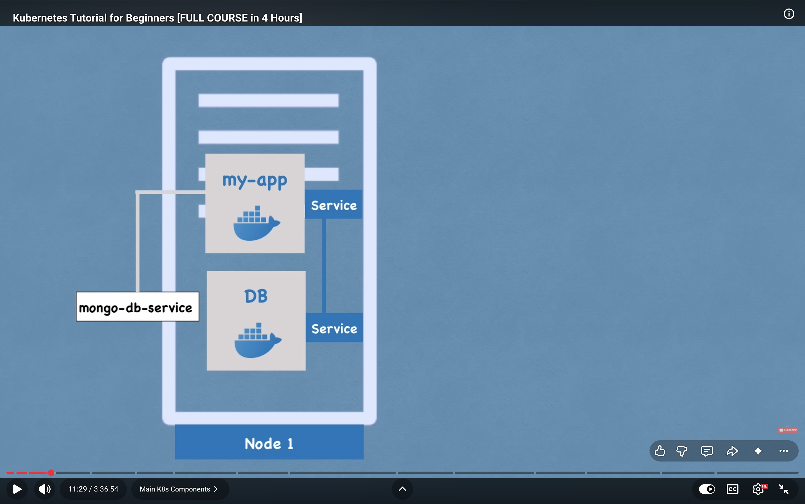

## Topics

# what is kubernetes
# k8's architecture
# k8's components
# minicube and kubectl
# Main Kubectl commands
# k8's YAML configurartion file
# k8's Namespaces -organize your components
# k8's Ingress
# Helm package manager   
# volumes -persisting Data
# K8's stateful Deploy stateful Apps
# K8's Services

Definition 
- open source orcestration tool
- Developed by google
- Helps you maintain containarized Applications in different environments 

Need
- Monolith to microservices
- incresed usage of containers

Features
- High Availability
- Scalability
- Disaster Recovery (Backup and restore)

Kubernetes Components

** Node and pod

(Pod)
- Smallest unit of k8's
- abstraction over containers
- usually one app lication per pod
- Each pod gets its own IP address so app can talk to the database with those address
- New IP Adress whenever the pod restarts and is inconvinient cause we have to adjust it evrytime the pod restarts (Here Service comes in play) 

*** we onky connect with kubernetes layer ***

(Service)
- permanent IP adress
- lifecycle of pod and Service are not connected so even if the pod dies we dont have to change the end points

External and INternal Services basically external that is expozed and the internal that is not

