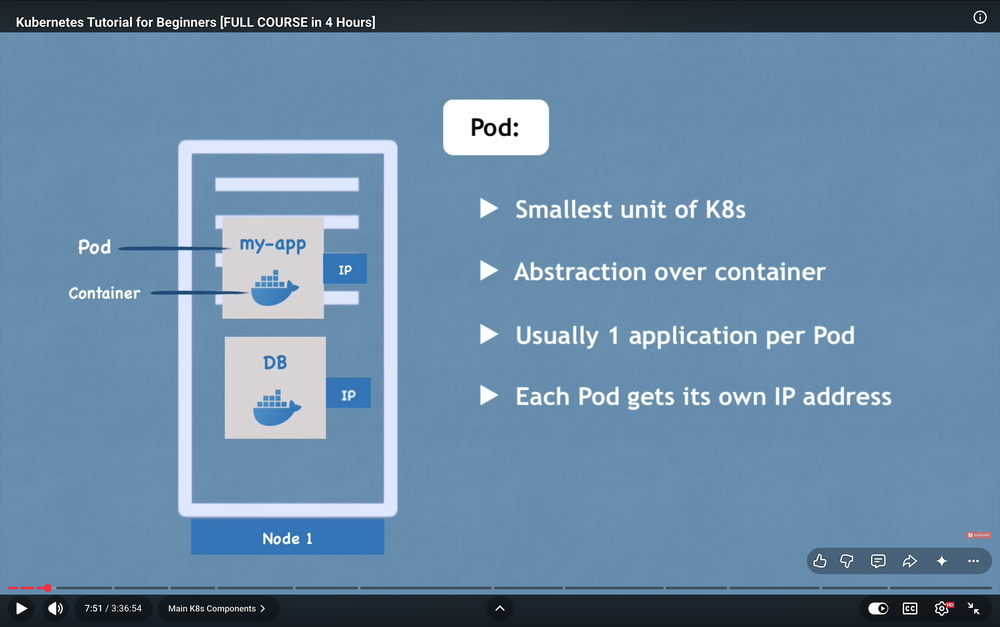
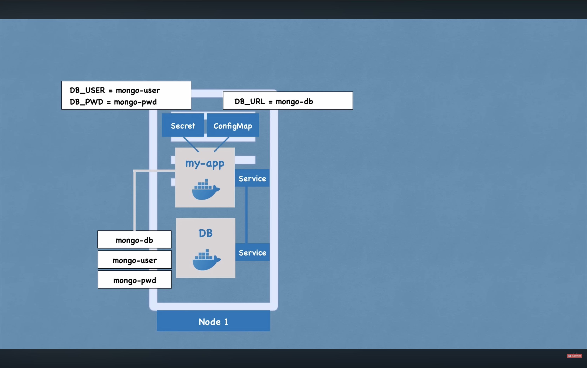
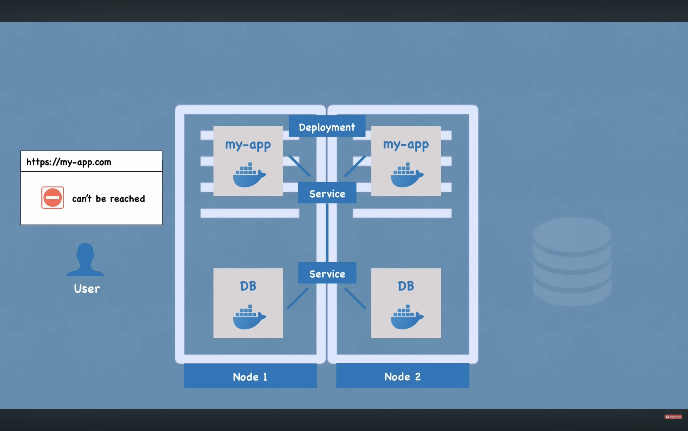
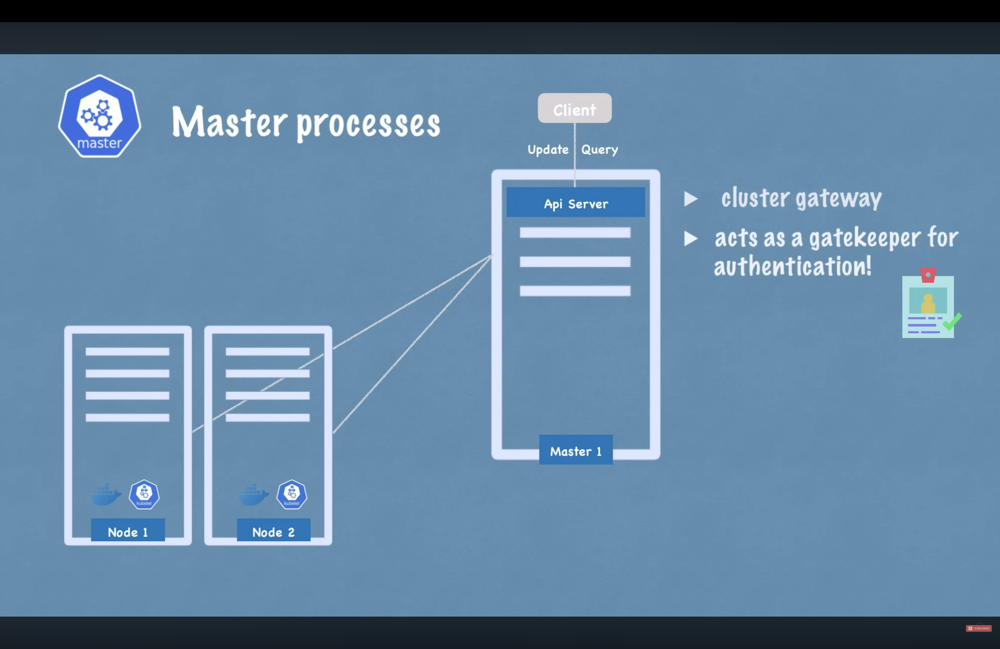
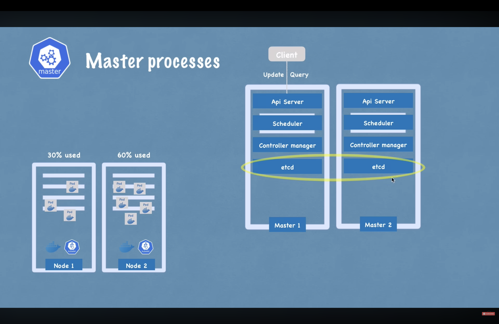
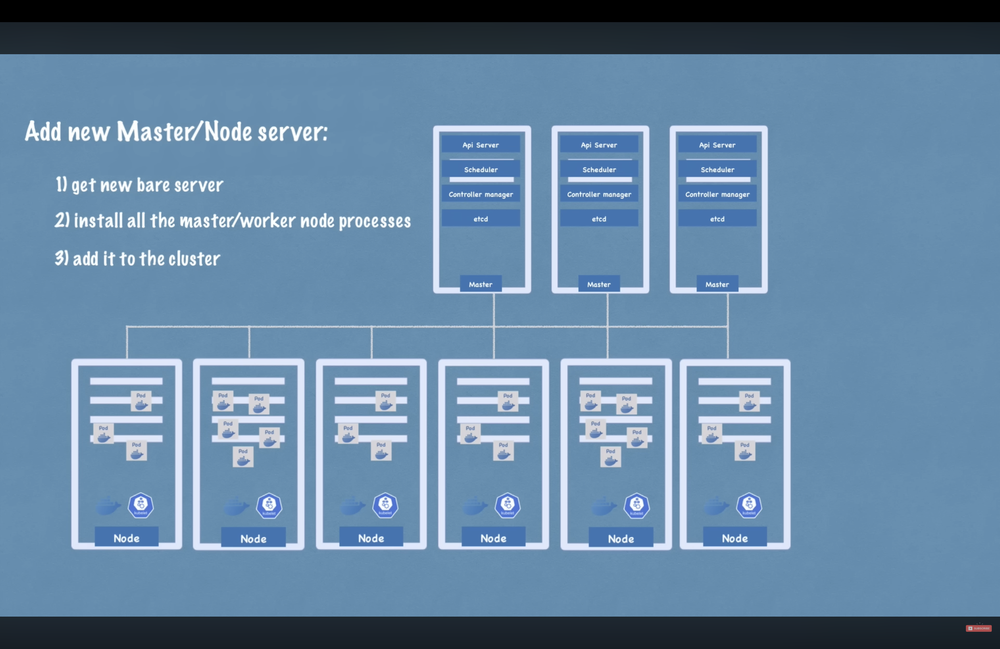

## Topics

# what is kubernetes
# k8's architecture
# k8's components
# minicube and kubectl
# Main Kubectl commands
# k8's YAML configurartion file
# k8's Namespaces -organize your components
# k8's Ingress
# Helm package manager   
# volumes -persisting Data
# K8's stateful Deploy stateful Apps
# K8's Services

Definition 
- open source orcestration tool
- Developed by google
- Helps you maintain containarized Applications in different environments 

Need
- Monolith to microservices
- incresed usage of containers

Features
- High Availability
- Scalability
- Disaster Recovery (Backup and restore)

Kubernetes Components

** Node and pod

(Pod)
- Smallest unit of k8's
- abstraction over containers
- usually one application per pod
- Each pod gets its own IP address so app can talk to the database with those address
- New IP Adress whenever the pod restarts and is inconvinient cause we have to adjust it evrytime the pod restarts (Here Service comes in play) 

*** we onky connect with kubernetes layer ***

(Service)
- permanent IP adress
- lifecycle of pod and Service are not connected so even if the pod dies we dont have to change the end points
External and Internal Services basically external that is expozed and the internal that is not

(Ingress)
We dont want our apllicatio to look like https://123.0.0.1 thats is where ingress come in game we send request which goes first to ingress and than it tranfer to service so now it will go to https://my-app

(config Map)
- external configuration of you application it is needed because we do give the datanase url in build image of application. so if the end point change than we have to rebuild and push it to repo and pull that new image in pod and restart
Now if we change the name of service thn we just adjust the config map and we need not to go in the cycle
- Dont put credentials in config map for this we have (Secret)-->Base64 encoded

(Volumes)
- if the database pod restarts the data is gone herer volume comes in game
- It basically attacghes the physical storage to the pod from remote(cloud) or local
*** k8's doesnot manage data persitance ***

(Deployment and Stateful set)

- We make a replica of everything so if one pod fail it will not be like site not reached or down
- we will point it to the same ip service as its permanent IP and it also works as a load balancer
- for this we need not to make one more node we can specify it in blueprint of my-app pods
- we create deployment which works on the top of pods which replicate the pods when fails and do some other configurations

*** Database cant be replicated via deployment ***
Bacause database has state  if we have cloned and replicas of database they would all need to acees the same data storage so we should have mechanism to cghek which pod is writing and which is viewing to avoid consitency and here the stetfulset comes into play
Statefull sets for statefull apps or Database and stefull sets just like deployent will replicate the pods but will also insure consitency

## Basic Architecture of Kubernetes

-> Node processes

-Master Node and slave node

-in Each node we have multiple pods
-3 processes must be installed on every node(kubelet,kubeproxy and conatiner runtime)
    -container runtime(docker)
    -kubelet (interacts with boith container and node also starts the node with container inside)
    -communication via services
    -kubeproxy should also be there

## how to interact with this cluster
-schedule pod
-monitor
-re-schedule pod
join a new pod

- All this is done by master nodes
- 4 processes run on all master nodes
    API Server
        -validate requests and security a;lso as only one entry point
        
    Scheduler
        -where to put the pod
        - it decide on which node the new pod will be scheduled
    controller manager
        -detects cluster state changes and if pod dies it decide to recover those
    etcd
        -key value store of cluster state
        -it is a cluster brain
        -cluster changes gets stored in key value
        -Application data is not stored in the etcd

example of cluster setup and how to add master or slave

## Minicube
-Multiple master and multiple slave nodes
-basically the master processes and slave processes work on same machine

-basically its jsut for starting and deleting the cluster but rrst evruthing we do with kubectl
-it creates a virtual box and the node run in a virtual box
-1 node k8s cluster
-for testing purpose
-now we need some way to interact with the cluster this is where kubectl comes in game

## kubectl
-it is a command line tool
-with this we can do anuthing 
-it can be used for cloud clusteer as well and can be used to interact with anytype of cluster

